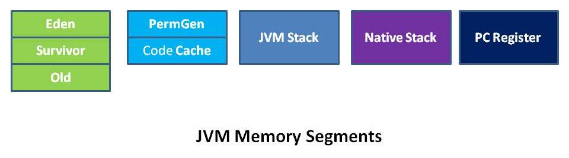

### BTree的理解
首先BTree分为 

1. Binary Tree
2. B Tree
3. B+ Tree
4. B* Tree

## Binary Tree

二叉查找树（英语：Binary Search Tree），也称为二叉搜索树、有序二叉树（ordered binary tree）或排序二叉树（sorted binary tree），是指一棵空树或者具有下列性质的二叉树：

* 若任意节点的左子树不空，则左子树上所有节点的值均小于它的根节点的值；
* 若任意节点的右子树不空，则右子树上所有节点的值均大于它的根节点的值；
* 任意节点的左、右子树也分别为二叉查找树；
* 没有键值相等的节点。

### B Tree

> 在计算机科学中，B树（英语：B-tree）是一种自平衡的树，能够保持数据有序。这种数据结构能够让查找数据、顺序访问、插入数据及删除的动作，都在对数时间内完成。B树，概括来说是一个一般化的二叉查找树（binary search tree），可以拥有最多2个子节点。
> 
> 与自平衡二叉查找树不同，B树适用于读写相对大的数据块的存储系统，例如磁盘。B树减少定位记录时所经历的中间过程，从而加快存取速度。
> 
> B树这种数据结构可以用来描述外部存储。这种数据结构常被应用在数据库和文件系统的实现上。
[2018-11-20-BTree的理解.md](:storage/c7faa6e7-0171-4ec2-9d8a-ec9de2261fb8/6721e0b6.md)

### B+ Tree

### 参考资料

<a href="https://zh.wikipedia.org/wiki/%E4%BA%8C%E5%85%83%E6%90%9C%E5%B0%8B%E6%A8%B9">维基百科：二叉查找数</a>
